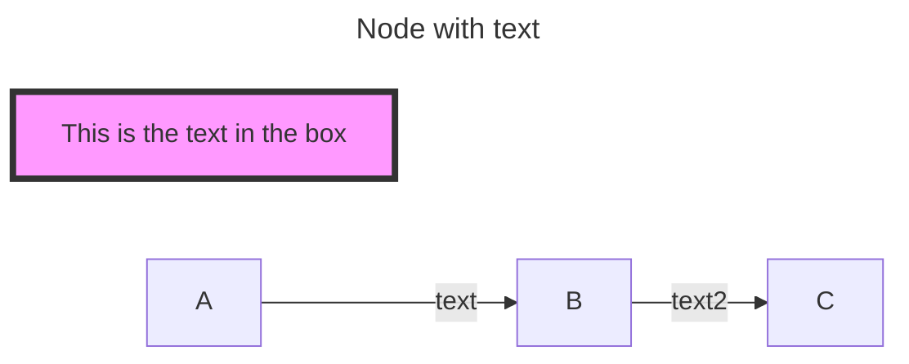
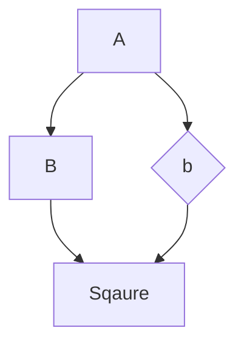
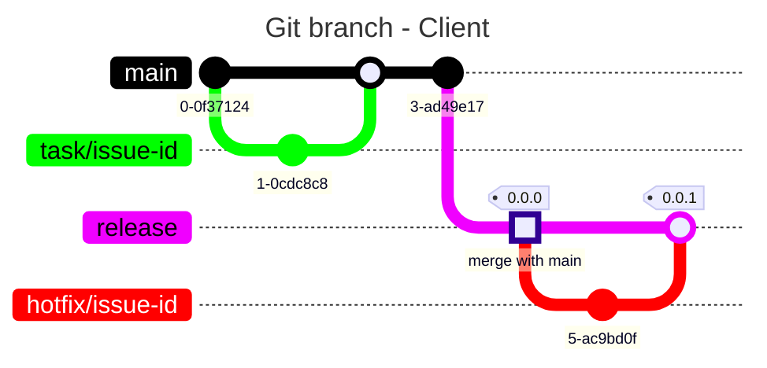
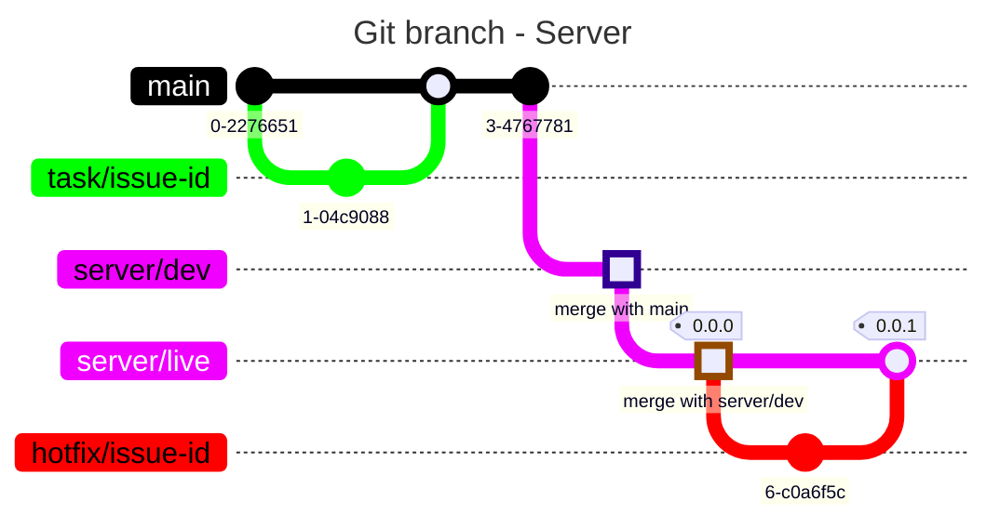
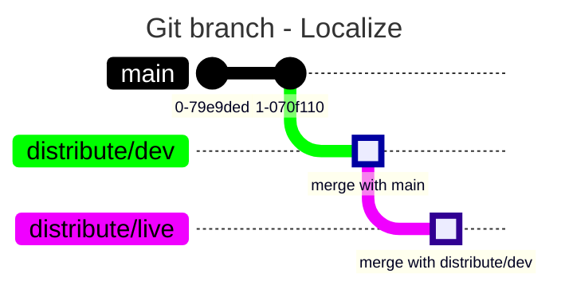

# Mermaid

- <https://mermaid.js.org/>
  - JavaScript based diagramming and charting tool
- <https://github.blog/2022-02-14-include-diagrams-markdown-files-mermaid/>
  - Mermaid는 Javascript를 이용 브라우저에서 실행되며 SVG를 이용 렌더링
  - Plantuml에는 Java와 GraphViz가 필요합니다.

|           |                     |
| --------- | ------------------- |
| 확장자    | `.mermaid` , `.mmd` |
| MIME type | `text/vnd.mermaid`  |

## TEST


## ETC




|     |                 |                                 |
| --- | --------------- | ------------------------------- |
| TB  | 위에서 아레     | Top to bottom                   |
| TD  | 위에서 아레     | Top-down/ same as top to bottom |
| BT  | 아레서 위       | Bottom to top                   |
| RL  | 오른쪽에서 왼쪽 | Right to left                   |
| LR  | 왼쪽에서 오른쪽 | Left to right                   |

|                 |                                     |
| --------------- | ----------------------------------- |
| sequenceDiagram |                                     |
| gitGraph        |                                     |
| flowchart       |                                     |
| classDiagram    |                                     |
| stateDiagram-v2 |                                     |
| C4Context       | 미묘...                             |


```
subgraph title
    graph definition
end
```

`%%`는 주석




GameSir G8 Galileo

## VSCode Extension

- [Mermaid Editor](https://marketplace.visualstudio.com/items?itemName=tomoyukim.vscode-mermaid-editor)
- [Mermaid Markdown Syntax Highlighting](https://marketplace.visualstudio.com/items?itemName=bpruitt-goddard.mermaid-markdown-syntax-highlighting)


| commit type |
| ----------- |
| NORMAL      |
| REVERSE     |
| HIGHLIGHT   |




    



## Ref

- https://www.dandoescode.com/blog/plantuml-vs-mermaid